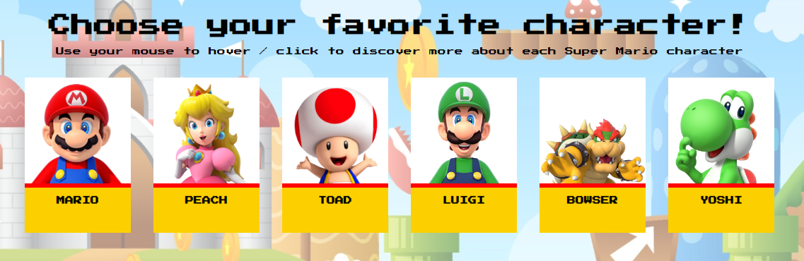

  

<h1 align ="center"> SUPER MARIO - Website</h1>

 
 Choose your favorite character from the Mushroom Kingdom by hovering the mouse!
  

  

Once you choose it,  you can learn more about the character!
  

 

 
🖥️ HTML | CSS 